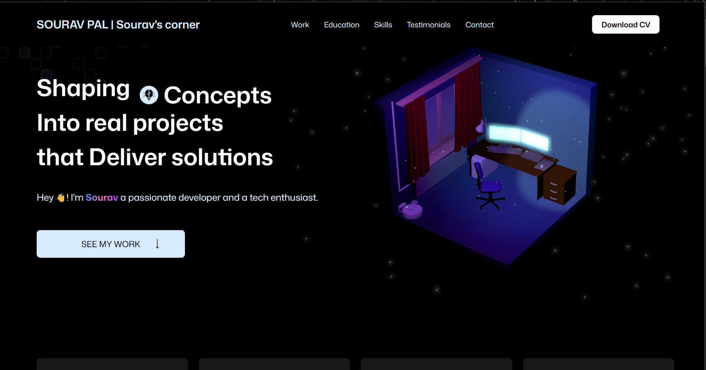

# 🌟 Welcome to **Sourav’s Corner** — A Creative Developer Portfolio Built with ❤️
Explore Sourav Pal's personal developer portfolio — showcasing modern web projects, full-stack skills, and a passion for building interactive, responsive, and visually engaging applications and deliver the optimized solutions.

---

## 🌐 Live Demo

🔗Check my portfolio here --> [souravpaldev](https://souravpaldev.vercel.app)

---

## 🛠️ Tech Stack

| Tech             | Description                                  |
|------------------|----------------------------------------------|
| **React.js**     | Component-based frontend framework            |
| **Tailwind CSS** | Utility-first responsive styling              |
| **Framer Motion**| Smooth animations and transitions             |
| **GSAP**         | Advanced scroll-based animations              |
| **ScrollTrigger**| Scroll-based triggers for GSAP animations     |
| **EmailJS**      | Contact form integration with email support   |
| **Three JS**     | Implementing 3D animations and using lights   |
| **Vercel**       | Hosting portfolio with built-in analytics     |

---

## 📁 Getting the Source Code

### Clone the Repository

```bash
git clone https://github.com/Souravpal08/MyPortfolio.git
cd dev-portfolio
npm install
npm run dev

```


## 🎯 Project Goals

✨ Showcase my full-stack and frontend skills

💼 Create a professional space for project and resume sharing

📬 Enable direct communication through a functional contact form.

📈 Attracting recruiters and further oppurtunities.


## ✨ Features

⚡ Responsive and modern animation based UI/UX

🎬 Smooth scroll-based animations (GSAP + ScrollTrigger)

📨 Functional contact form with EmailJS

📄 Downloadable CV button with tracking

📊 Analytics via Vercel

🔁 Reusable, modular React components


## 📜 License

This project is licensed under the MIT License.

MIT License

Copyright (c) 2025 Sourav Pal

Permission is hereby granted, free of charge, to any person obtaining a copy
of this software and associated documentation files or assets.
